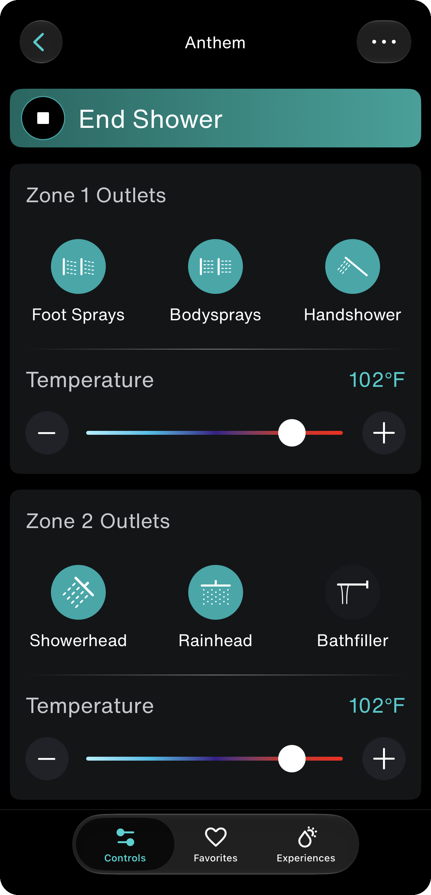
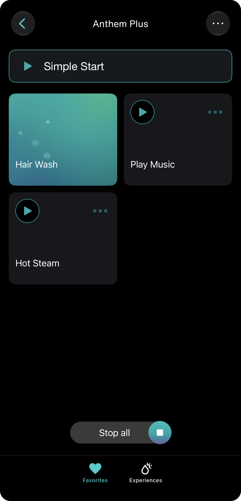
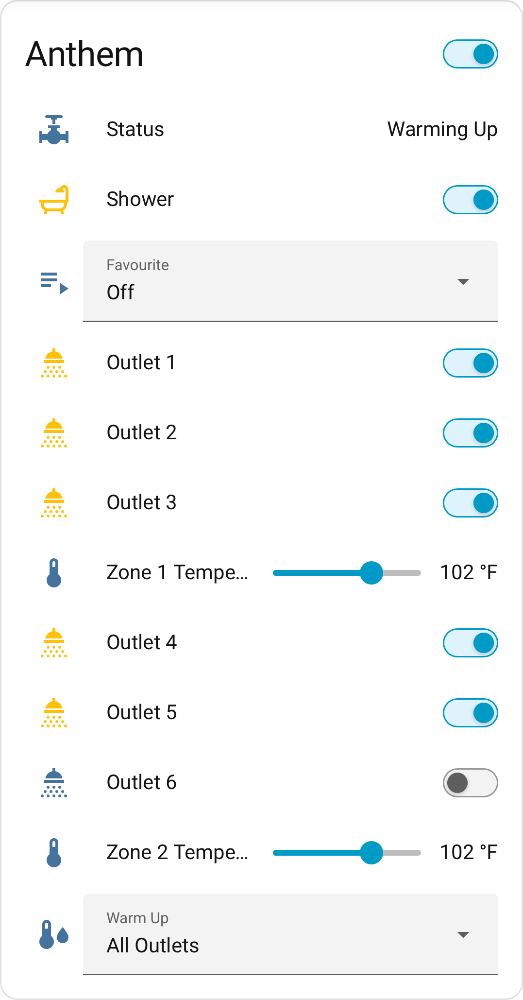
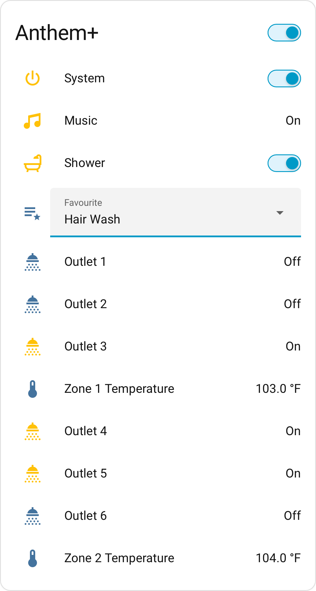

  <picture>
    <source media="(prefers-color-scheme: dark)" srcset="docs/images/anthem-system-dark.png">
    
  </picture>

<h1 align="center">Kohler Anthem Plus</h1>

  Home Assistant integration for <b>Kohler Digital Anthem</b> and <b>Anthem+</b> shower systems.

  
  
  

  Unofficial. Not affiliated with or endorsed by Kohler.

---

Kohler sells two products under the Anthem name, and an account can have either or both. They
speak different protocols, so they arrive in Home Assistant as **two devices** — and if you own
both, you get both.

<table>
<tr>
<th width="50%">Anthem THE VALVE CARD</th>
<th width="50%">Anthem Plus THE CONTROLLER CARD</th>
</tr>

<tr>
<td align="center">IN THE KONNECT APP  

</td>
<td align="center">IN THE KONNECT APP  

</td>
</tr>

<tr>
<td align="center">IN HOME ASSISTANT  
<picture>
  <source media="(prefers-color-scheme: dark)" srcset="docs/images/ha-anthem-valve-dark.png">
  
</picture>
</td>
<td align="center">IN HOME ASSISTANT  
<picture>
  <source media="(prefers-color-scheme: dark)" srcset="docs/images/ha-anthem-plus-dark.png">
  
</picture>
</td>
</tr>

<tr>
<td valign="top">
HIGHLIGHTS
<ul>
<li><b>Per-outlet control</b> — every outlet is its own switch, in both zones.</li>
<li><b>Custom outlet service</b> — a service call that sets any outlet, temperature and flow
combination the dropdowns can't reach.</li>
<li><b>Endless Shower</b> — the hardware will not run a shower past <b>60 minutes</b>, its longest
allowed setting. This reopens the zone the moment the valve closes it, same outlets, same
temperature.</li>
<li><b>Live outlet and temperature</b> — move a setpoint or flip an outlet and the water follows
immediately. No scene to apply, no confirm step.</li>
<li><b>Warm-up modes</b> — pre-heat before you step in, put back if something disables it.</li>
</ul>
</td>
<td valign="top">
HIGHLIGHTS
<ul>
<li><b>Per-outlet and temperature sensors</b> — what the controller sees, outlet by outlet.</li>
<li><b>Start the default shower</b> — one switch, no scene to pick first.</li>
<li><b>Stop everything at once</b> — one switch ends the shower, music, steam and light together.
The touchscreen makes you stop each of them separately.</li>
<li><b>Music, steam and light</b> — each reported as its own sensor.</li>
</ul>
</td>
</tr>

<tr>
<td align="center">HARDWARE  

&nbsp;+&nbsp;

 
<b>Digital Valve</b> &nbsp;+&nbsp; <b>Anthem Interface</b> (K-28214)
</td>
<td align="center">HARDWARE  

&nbsp;+&nbsp;

&nbsp;+&nbsp;

 
<b>Digital Valve</b> &nbsp;+&nbsp; <b>System Controller</b> (K-27756) &nbsp;+&nbsp;
<b>Anthem+ Interface</b> (K-28214-ASC)
</td>
</tr>

<tr>
<td colspan="2" align="center">
BOTH AT ONCE — ONE VALVE, TWO INTERFACES
  

&nbsp;+&nbsp;

&nbsp;+&nbsp;

&nbsp;+&nbsp;

  
A digital valve has <b>two interface ports</b>, so the Anthem interface and the system controller
can be wired to the same valve at the same time. Home Assistant then shows <b>both cards</b> — the
valve and the controller — as two devices.
</td>
</tr>
</table>

## Real-time state

Kohler's cloud pushes every change over Azure IoT Hub MQTT, and the integration simply listens —
there is **no polling loop at all**. REST is read twice: once at setup, and again on every
reconnect, because the broker replays nothing when you join.

* **Seconds, not intervals.** A poller has to choose between stale state and hammering someone
  else's cloud. Push has no interval — a change at the touchscreen, in the Konnect app, or by the
  valve itself is here as it happens.
* **Every transition, not just the endpoints.** Short-lived states slip between polls: a pause that
  resolves after about two minutes, a run-time cutoff and the restore right behind it. Push carries
  each one.
* **Automations fire on the event.** Not on the next scheduled check, and never an interval late.
* **No token churn.** Nothing refreshing credentials on a timer against an identity provider that
  rotates its refresh token on every use.

## What you would actually do with it

* **Start the shower from the wall.** Bind it to a scene controller by the door — no phone, no
  touchscreen.
* **Clear the steam afterwards.** Run the exhaust fan for 30 minutes after the water stops, then
  shut it off.
* **Music on the same switch.** One press starts the shower and the playlist together.
* **One command ends everything.** Shower, music, steam and light, in a single action.
* **Dim the lights when it is ready.** The moment the water reaches temperature, drop the bathroom
  lights to where you want them.
* **Fill the tub on the way home.** Fifteen minutes of tub filler, timed to when you actually
  arrive.

## Requirements

* Home Assistant **2024.2** or later
* A Kohler Konnect account, with the shower already set up in the Konnect app
* **Internet access.** Control is cloud-only for both products. If Kohler's cloud is unreachable,
  nothing here can turn the shower on or off.

The only Python dependency is `paho-mqtt`, installed automatically.

## Install

This integration is **not in HACS's default store.** Add it as a custom repository.

**Via HACS**

1. In HACS, open the ⋮ menu and choose **Custom repositories**
2. Add `https://github.com/frozenmartini/kohler-anthem-plus`, category **Integration**
3. Find **Kohler Anthem Plus** in HACS and install it
4. Restart Home Assistant

HACS installs from **releases**, not from the latest commit.

**Manually**

This repository **is** the integration — `manifest.json` sits at its root. Copy its contents into
`config/custom_components/kohler_anthem_plus/` in your Home Assistant configuration directory (the
folder name must be exactly `kohler_anthem_plus`) and restart.

## Setup

**Settings → Devices & Services → Add Integration → Kohler Anthem Plus**

Sign in with your Konnect account and you are done. The integration reads the account, works out
which hardware you have — valve model, how the outlets split across zones, whether a controller is
in front of it — and builds the matching devices itself. Your password is exchanged for a token and
never stored, and temperature units follow whatever your Konnect account already uses.

There is no Configure dialog. Every setting that can change after setup is an entity on the device
page, where automations and dashboards can reach it too.

## Supported valves

A physical Anthem valve is one unit containing up to two zones, each with up to three outlets.

| Model | Outlets | Zone 1 | Zone 2 |
|---|---|---|---|
| K-28209 | 2 | 2 | — |
| K-28210 | 3 | 3 | — |
| K-28211 | 4 | 2 | 2 |
| K-28212 | 6 | 3 | 3 |

An installation that doesn't match one of these four still works — an unrecognised outlet split
produces a usable model rather than an error.

> ⚠️ **Digital Anthem, not the mechanical Anthem.** Kohler sells both under that name. Only the
> digital, network-connected one has an API to talk to.

## Reporting

Different hardware is the most useful thing anyone can contribute. Two things make a report
diagnosable:

* **Download diagnostics** — on the integration card and both device pages. One JSON report of the
  whole installation, with credentials, account identity and serial numbers redacted. On anything
  other than a K-28212, this is the single most useful file you can send.
* **Report Log** — a switch on both device pages that captures every raw MQTT message, one file per
  switch-on, continuing across a Home Assistant restart so "it breaks when I restart" stays one
  piece of evidence.

**Check both before sharing** — they carry device identifiers and show when the shower was used.
The reports folder lives inside the integration, so updating or reinstalling deletes it.

## Known limitations

* **Cloud-only.** No local control path exists for either product.
* **No flow entity.** The valve honours a flow byte, but the Anthem Plus touchscreen overwrites
  temperature and flow, so a setpoint could not be relied on to stay put.
* **Music, lighting and steam are read-only.** Driving them means activating a favourite that
  includes them.
* **Warm-up's selected outlets cannot be read** from the cloud API — that lives on the controller's
  local API.
* **The API is undocumented** and Kohler can change it without notice.
* **One installation tested.** A single K-28212 — six outlets, three and three — with a controller
  on firmware 2.88. Other models are supported on what the protocol says, not on anyone having run
  them.

This is an unofficial, community-built integration, reverse-engineered from Kohler's cloud
protocol. It is not a supported product, and it comes with no warranty of any kind. Anything that
can run water deserves that caution.

## Documentation

**[The full guide](docs/user_guide.md)** covers every entity, the `send_valve_hex` service, each
feature in detail, automation examples and troubleshooting.

**[`docs/`](docs/)** is a complete protocol reference, not just integration notes — the valve
command word byte by byte, both REST APIs, the MQTT message catalogue, and case studies that work
real showers through message by message. Start with
[`docs/architecture.md`](docs/architecture.md) for the two-device model.

## Prior art

[`docs/prior_art.md`](docs/prior_art.md) credits the two projects this one started from —
[kohler-konnect-ha](https://github.com/kenyonj/kohler-konnect-ha) and
[kohler-anthem](https://github.com/yon/kohler-anthem) — and records where their readings differ
from what the wire actually does.

## Licence and trademarks

MIT — see [LICENSE](LICENSE).

Kohler, Anthem, Anthem+ and Konnect are trademarks of Kohler Co. This project is not affiliated
with, authorised by, or endorsed by Kohler Co., and is not a supported product.
