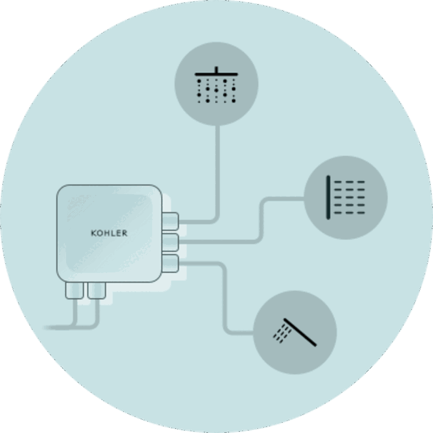
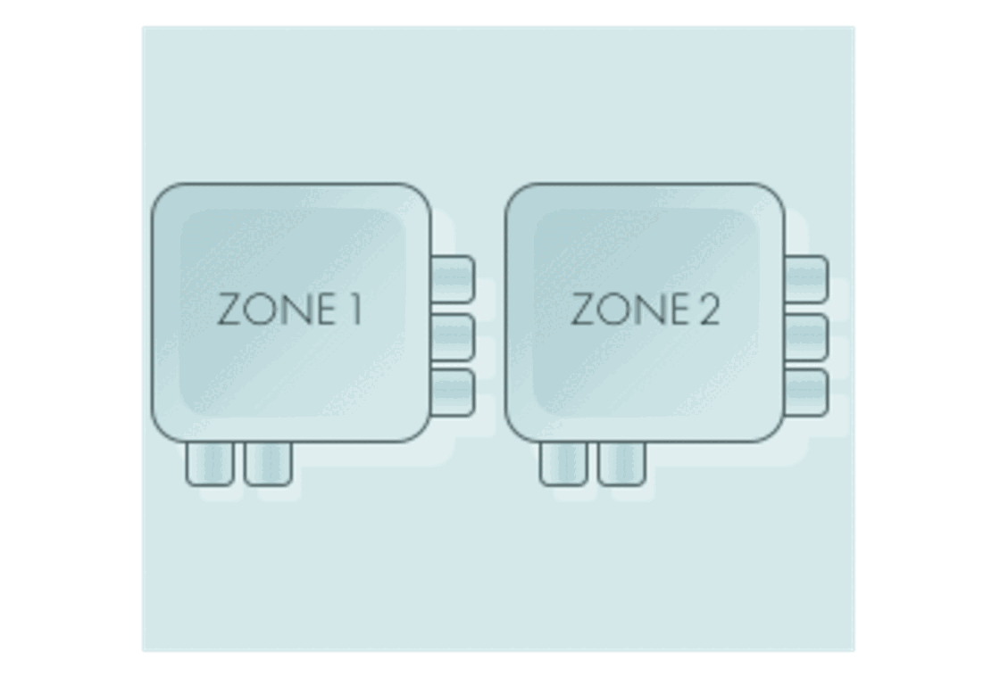
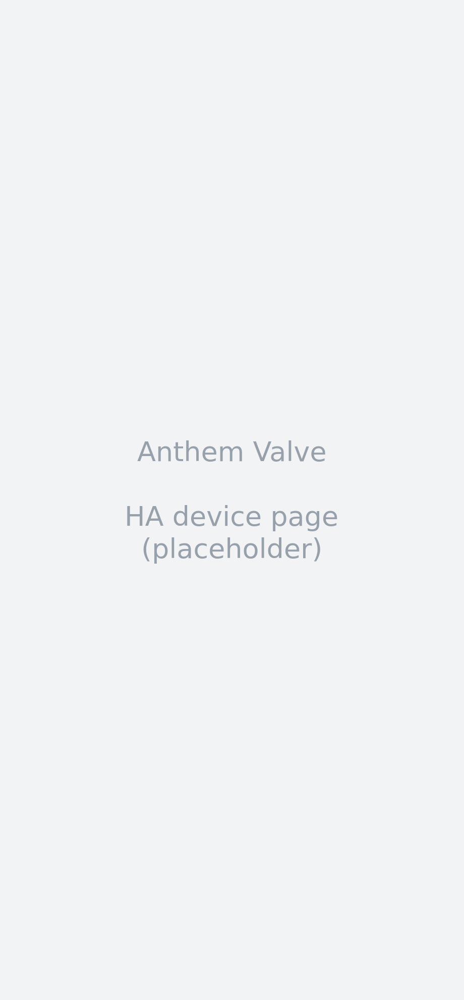
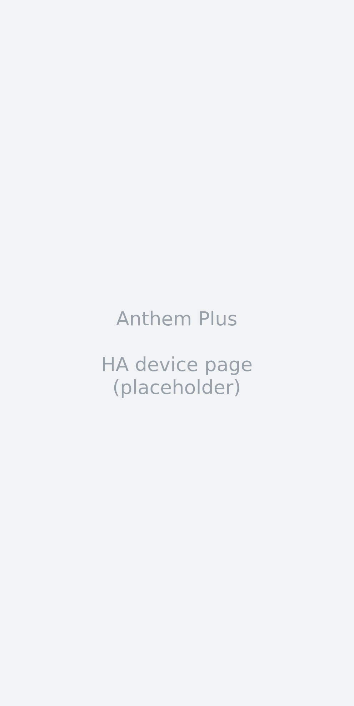

<p align="center">
  <picture>
    <source media="(prefers-color-scheme: dark)" srcset="images/anthem-system-dark.png">
    
  </picture>
</p>

<h1 align="center">Kohler Anthem Plus</h1>

<p align="center">
  Home Assistant integration for <b>Kohler Digital Anthem</b> and <b>Anthem+</b> shower systems.
</p>

<p align="center">
  <a href="#install"></a>
  
  
</p>

<p align="center">
  <sub>Unofficial. Not affiliated with or endorsed by Kohler.</sub>
</p>

<p align="center">
  <sub>The full guide. For the short overview, see the <a href="../README.md">README</a>.</sub>
</p>

---

## Contents

- [What it does](#what-it-does)
- [At a glance](#at-a-glance)
- [Two products, one integration](#two-products-one-integration)
- [How it works](#how-it-works)
- [In Home Assistant](#in-home-assistant)
- [Entities](#entities)
- [Services](#services)
- [Features in detail](#features-in-detail)
- [Requirements](#requirements)
- [Install](#install)
- [Setup](#setup)
- [Automation examples](#automation-examples)
- [Troubleshooting](#troubleshooting)
- [Known limitations](#known-limitations)
- [Tested against](#tested-against)
- [Documentation](#documentation)
- [Prior art](#prior-art)
- [Contributing](#contributing)
- [Licence and trademarks](#licence-and-trademarks)

---

## What it does

Puts your shower in Home Assistant — outlets, temperature, presets, and the Anthem Plus
controller's music, lighting and steam.

No official Kohler integration exists for this product. The community integrations that do
exist support only the older, simpler Anthem valve. This one was built by reverse-engineering
Kohler's Konnect cloud protocol from scratch, and every claim in its documentation is checked
against captured traffic from real hardware rather than against an app decompile alone.

State arrives by **push, not polling.** The integration subscribes to Kohler's Azure IoT Hub
MQTT stream and updates the moment the hardware reports a change (`iot_class: cloud_push`,
`SCAN_INTERVAL = None`). REST is read once at setup, and again on each reconnect to reseed —
the broker replays nothing when you connect, so the state has to come from somewhere.

## At a glance

* **Both products, one integration.** The Anthem valve and the Anthem+ controller appear as
  two devices, and you can have either or both.
* **Push-based.** No polling loop. Changes made at the touchscreen, in the Konnect app, or by
  the hardware itself show up in Home Assistant within seconds.
* **Per-outlet control.** Every outlet is a switch; every zone has a temperature number.
* **Presets and favourites.** The valve's stored presets and the controller's named
  favourites are both exposed as dropdowns.
* **Warmup.** Kohler's pre-heat feature as a three-option dropdown, with an optional watchdog
  that puts it back when something silently turns it off.
* **Endless Shower.** Optionally re-open a zone the valve closed on its own run-time limit.
* **Raw escape hatch.** A `send_valve_hex` service for anything the normal controls cannot do.
* **Forensics built in.** The integration writes its own MQTT capture and analysis journals,
  which is how most of `docs/` was established in the first place.

## Two products, one integration

Kohler sells two different things under the Anthem name, and an account can have either or
both. They speak different protocols, and most confusion about this system comes from
assuming there is one device when there are two.

| | **Anthem** (the valve) | **Anthem+** (the controller) |
|---|---|---|
| What it is | The digital valve itself, Wi-Fi built in | A Linux controller sitting in front of the valve |
| Adds | — | Music, lighting, steam |
| Controlled by | A raw hex command word — temperature, flow, outlet mask | Activating named favourites |
| Granularity | Any outlet, any temperature, any time | Whole scenes only |
| In the code and docs | `GCS` | `HUB` |

A physical Anthem valve is **one unit containing two zones**, each with up to three outlets:

<p align="center">
  <picture>
    <source media="(prefers-color-scheme: dark)" srcset="images/valve-zones-dark.png">
    
  </picture>
</p>

Four valve models exist, and the integration knows the outlet split for each:

| Model | Outlets | Zone 1 | Zone 2 |
|---|---|---|---|
| K-28209 | 2 | 2 | — |
| K-28210 | 3 | 3 | — |
| K-28211 | 4 | 2 | 2 |
| K-28212 | 6 | 3 | 3 |

An installation that doesn't match one of these four still works — an unrecognised outlet
split produces a usable model rather than an error.

> ⚠️ **Digital Anthem, not the mechanical Anthem.** Kohler sells both under that name. Only
> the digital, network-connected one has an API to talk to.

## How it works

**Two APIs, in two directions.** Commands go out over Kohler's Konnect REST API. State comes
back over Azure IoT Hub MQTT, which Kohler's cloud pushes to. There is no polling loop at all.

**REST is read twice, not repeatedly.** Once at setup, and again on every MQTT reconnect. The
broker replays no history on connect, so without that reseed the integration would sit blind
until the hardware happened to say something.

**The valve is commanded with a hex word.** Temperature, flow and an outlet bitmask packed
into four bytes. Temperature is a 10-bit value spanning two bytes — `°C = ((byte0 & 0x03) << 8
| byte1) / 10` — so `0x184` (388) is 38.8 °C, or 101.8 °F. Flow is a single byte from `0x10`
(16) to `0xC8` (200), where `0xC8` (200) is 100 %. The full breakdown, including the outlet
mask and the pause bit, is in [`gcs/valve_hex.md`](gcs/valve_hex.md).

**The controller is not commanded that way.** It only activates named favourites — whole
scenes configured in the Konnect app, combining outlets, temperature, lighting, music and
steam. You cannot ask it for "outlet 2 at 39 °C"; that goes to the valve.

**Both are cloud-only.** The controller exposes a local LAN API, but it can read configuration
and cannot actuate anything. Establishing that cost real debugging time; see
[`architecture.md`](architecture.md).

## In Home Assistant

Two devices, one per product, each with its own entities.

<p align="center">
  
  &nbsp;&nbsp;
  
</p>

## Entities

Entity IDs below assume the default device names **Anthem Valve** and **Anthem Plus**. If you
rename a device, its entity IDs change with it.

### Anthem valve

| Entity | Type | What it does |
|---|---|---|
| `Shower` | switch | Turns the shower on or off, preserving whichever outlets are currently open |
| `Zone N Outlet M` | switch | One per outlet |
| `Zone N Temperature` | number | Setpoint for that zone, in your account's unit |
| `Favourite` | select | The valve's stored presets |
| `Warmup` | select | Off / All outlets / Selected outlets |
| `Endless Shower` | switch | Re-open a zone the valve closed on its run-time limit |
| `Status` | sensor | `Water Running`, `Paused`, `Warming Up`, `Idle` |
| `At Temperature` | binary sensor | Whether the water has reached its setpoint |

### Anthem+ controller

| Entity | Type | What it does |
|---|---|---|
| `Shower` | switch | Starts or stops the shower via the controller |
| `System` | switch | The controller's overall system state |
| `Favourite` | select | Named favourites configured in the Konnect app |
| `Status` | sensor | `Water Running`, `Warming Up`, `Idle` |
| `Zone N Temperature` | sensor | Read-only; the controller offers no live temperature control |
| `Zone N Outlet M` | binary sensor | Read-only outlet state as the controller sees it |
| `Music` / `Light` / `Steam` | binary sensor | Read-only accessory state |

<details>
<summary><b>Diagnostic entities</b> — disabled or hidden by default, for protocol work rather than daily use</summary>

<br>

| Entity | Device | What it does |
|---|---|---|
| `MQTT Connection` | both | Whether the push stream is connected |
| `Last Update` | both | Timestamp of the most recent message |
| `Start new MQTT capture` | both | Button; rolls the raw capture over to a fresh file |
| `Report Log` | both | Switch; one-file bug-report capture of the raw MQTT stream — see [The Report Log switch](#the-report-log-switch) |
| `Zone N Hex` | valve | The current command word for that zone — copy it into `send_valve_hex` |
| `Zone N Outlet M Max Run Time` | valve | That outlet's configured run-time ceiling, in seconds |
| `Zone N Active` | valve | Whether that zone is currently running water |
| `Preset Active` | valve | Whether a stored preset is driving the valve |
| `Warmup Auto-Restore` | valve | Switch; puts warmup back when something silently disables it |

</details>

## Services

### `kohler_anthem_plus.send_valve_hex`

Sends a command word straight to the valve, for anything the normal controls cannot do —
setting a flow rate, for instance.

The workflow is copy-and-paste rather than hand-assembly. Set the shower up the way you want
it using the outlet switches and temperature controls, read the resulting code off the
`Zone N Hex` diagnostic sensor, and store that string. Sending it later reproduces that exact
state.

```yaml
action: kohler_anthem_plus.send_valve_hex
data:
  zone1_hex: "0184C801"      # zone 1, 38.8 °C, flow 0xC8 (200) = 100 %, outlet 1
  zone2_hex: "1184C801"      # optional; omitted entirely on a single-zone valve
```

Both fields accept 8 or 16 hex characters. On a single-zone valve the Zone 2 field is hidden
from the UI form automatically.

> ⚠️ **This can start water.** It writes directly to the valve with none of the guards the
> switches apply.

## Features in detail

### Favourites and presets

The valve stores presets; the controller stores named favourites. Both are exposed as
`select` entities, and both are configured in the Konnect app rather than here — this
integration activates them, it doesn't create them.

### Warmup

Kohler's pre-heat feature: run water until it reaches temperature, so the shower is ready
when you step in. The dropdown offers the three modes the app can actually write —
**Off**, **All outlets**, **Selected outlets**.

> **"All outlets" skips a tub filler** (measured): a warm-up that ran the tub filler would
> fill the tub, so the valve leaves that outlet closed and warms through the others.

The protocol defines five modes, including two delayed-start variants. Those remain decodable
because a valve can be holding one, but nothing defines their delay and they are refused as
write targets. If your valve is holding one, it appears in the dropdown while it is in force
and disappears once you change it.

> Which outlets "Selected outlets" refers to is **not readable from the cloud API.** That
> lives in per-zone configuration on the controller's local API.

### Warmup auto-restore

Off by default. Turn it on if your warmup mode keeps turning itself off.

On this installation, warmup kept reverting to **Off** with no visible cause. The cause is now
identified and documented: **ordinary signed-in use of the Anthem Plus controller's local web
UI silently writes the valve's warmup mode to disabled** — a PIN sign-in alone is enough —
every time, as a fixed part of its login routine. It cannot be prevented from outside the
hub's firmware, so putting the mode back is the fix that exists. Reproduced live six times in
one day; the full evidence is in [`gcs/api.md`](gcs/api.md) §3h.

When enabled, this switch sets the mode back sixty seconds after a disable this integration
did not cause — including one discovered only on reconnect, after it happened while the push
stream was down — and writes a journal entry with a window of MQTT traffic either side, which
is how the cause was established in the first place.

It is deliberately cautious. It will not undo a disable this integration performed itself, it
will not fire on a restatement after a reboot, it stops after five restores that fail to
stick, it never writes while water is running, and it does nothing at all unless it has
previously seen the mode enabled.

### Endless Shower

The valve enforces a maximum run time per outlet and closes the zone when it's reached. With
this switch on, the integration re-opens the zone with the same outlets and temperature,
producing a shower that doesn't stop on its own.

> ⚠️ This deliberately defeats a safety-adjacent limit. It is off by default, and you should
> understand why that limit exists on your installation before turning it on.

### The Report Log switch

The quick way to capture evidence for a bug report — or to document a healthy run on
hardware this integration has never been verified against. A **Report Log** switch sits on
both device pages (diagnostic section):

* **Switch on** → a new capture file starts, recording every raw MQTT message.
* **Restart Home Assistant mid-capture** → the same file continues. "It breaks when I
  restart" is a bug report too, so the restart never splits the evidence.
* **Switch off** → the capture ends. The next switch-on starts a fresh file.

Files land in `custom_components/kohler_anthem_plus/reports/` (a `README.txt` there explains
them), one per capture, capped at 8 MB with continuation parts. Attach them to a GitHub
issue along with the diagnostics download. **Check them before sharing** — they contain your
device identifiers and show when the shower was used. And note the folder lives inside the
integration itself, so **updating or reinstalling the integration deletes it**; move files
you want to keep first.

### Captures and journals

Separately from the Report Log, the integration writes its development evidence to
`/config/kohler_anthem_plus_raw/`:

| File | What it holds |
|---|---|
| `raw_mqtt_*.jsonl` | Every MQTT message, as received |
| `cutoff_*.jsonl` | Run-time cutoff events and how each resolved |
| `warmup_*.jsonl` | Warmup mode changes, with traffic windows either side |

Each is capped at 8 MB per file and rolls over rather than pruning. The `Start new MQTT
capture` button opens a fresh file, which is useful before a deliberate experiment. If you
report a problem, these are the files that make it diagnosable —
[`mqtt/capture_runbook.md`](mqtt/capture_runbook.md) explains how to read them.

## Requirements

* Home Assistant **2024.2** or later
* A Kohler Konnect account, with the shower already set up in the Konnect app
* **Internet access.** Control is cloud-only for both products. If Kohler's cloud is
  unreachable, nothing here can turn the shower on or off.

The only Python dependency is `paho-mqtt`, installed automatically.

## Install

This integration is **not in HACS's default store.** Add it as a custom repository.

### Via HACS

1. In HACS, open the ⋮ menu and choose **Custom repositories**
2. Add `https://github.com/frozenmartini/kohler-anthem-plus`, category **Integration**
3. Find **Kohler Anthem Plus** in HACS and install it
4. Restart Home Assistant

> HACS installs from **releases**, not from the latest commit.

### Manually

This repository **is** the integration — `manifest.json` sits at its root. Copy its contents
into `config/custom_components/kohler_anthem_plus/` in your Home Assistant configuration
directory (the folder name must be exactly `kohler_anthem_plus`) and restart.

## Setup

**Settings → Devices & Services → Add Integration → Kohler Anthem Plus**

1. **Sign in** with your Konnect username and password. Credentials are exchanged for a token;
   the password is not stored.
2. **Confirm your valve model.** The integration detects the outlet split from your account
   and pre-selects the matching model, so this is usually one click.

Temperature and water units are read from your Konnect account, not chosen here — set them in
the Konnect app and they follow.

There is no Configure dialog — every setting that can change after setup is an entity on the
device page (`Endless Shower`, `Warmup`, `Warmup Auto-Restore`), where automations and
dashboards can reach it too.

### Diagnostics

Every device page and the integration card have a **Download diagnostics** button. It
produces one JSON report describing the whole installation — model and outlet split as
detected, what each device is reporting, configured limits — with credentials, account
identity, and device serial numbers redacted. If you're on hardware other than a K-28212,
attaching that file to an issue is the single most useful thing you can send.

## Automation examples

**Notify when the shower is up to temperature**

```yaml
automation:
  - alias: Shower ready
    triggers:
      - trigger: state
        entity_id: binary_sensor.anthem_valve_at_temperature
        to: "on"
    actions:
      - action: notify.mobile_app
        data:
          message: Shower is at temperature.
```

**Start a favourite from anywhere**

```yaml
automation:
  - alias: Morning shower
    triggers:
      - trigger: time
        at: "06:30:00"
    actions:
      - action: select.select_option
        target:
          entity_id: select.anthem_plus_favourite
        data:
          option: Morning
```

**Pre-heat when you leave work**

```yaml
automation:
  - alias: Warm the shower on the way home
    triggers:
      - trigger: zone
        entity_id: person.me
        zone: zone.work
        event: leave
    actions:
      - action: select.select_option
        target:
          entity_id: select.anthem_valve_warmup
        data:
          option: All outlets
```

**Alert if the cloud connection drops**

```yaml
automation:
  - alias: Anthem offline
    triggers:
      - trigger: state
        entity_id: binary_sensor.anthem_valve_mqtt_connection
        to: "off"
        for: "00:05:00"
    actions:
      - action: persistent_notification.create
        data:
          message: Lost the push connection to the Anthem valve.
```

## Troubleshooting

**Entities are unavailable, or state is stale.** Check the `MQTT Connection` diagnostic binary
sensor on either device. Control is cloud-only, so an internet outage or a Kohler-side problem
takes everything with it. The integration reconnects and reseeds from REST on its own.

**Home Assistant keeps asking me to sign in again.** Kohler's identity provider rotates the
refresh token on every use. If another tool is refreshing the same grant, it invalidates the
copy Home Assistant holds. Give this integration its own sign-in.

**The Warmup dropdown has an option I didn't expect.** Your valve is holding one of the two
legacy delayed-start modes. It's shown so Home Assistant can display the true state, and it
disappears once you select something else. You can't select it.

**The shower stops after about fifteen minutes.** That's the configured maximum run time, and
it's working as designed. `Zone N Outlet M Max Run Time` shows the ceiling per outlet. The
`Endless Shower` switch will re-open the zone if you want that behaviour.

**Zone 2 entities are missing.** Expected on a single-zone valve — K-28209 and K-28210 have
one zone.

**Temperature is in the wrong unit.** It follows your Konnect account. Change it in the
Konnect app.

## Known limitations

* **Cloud-only.** No local control path exists for either product. The controller's local API
  can read configuration but cannot actuate anything.
* **No flow entity.** The codec handles flow correctly and the valve honours a flow byte, but
  the Anthem Plus touchscreen overwrites both temperature and flow, so a Home Assistant
  setpoint could not be relied on to stay put. Use `send_valve_hex` if you need it.
* **Music, lighting and steam are read-only.** The controller exposes them as state; driving
  them means activating a favourite that includes them.
* **Warmup's selected outlets can't be read** from the cloud API.
* **One installation tested.** See below.
* **The API is undocumented** and Kohler can change it without notice.

## Tested against

**One installation.** A single K-28212 — 6 outlets, 3 + 3 across two zones — plus an Anthem
Plus controller on firmware 2.88. Every finding in [``](./) is derived from and
verified against that one system.

Other models and configurations are supported on the basis of what the protocol says, not on
the basis of anyone having run them. If you have different hardware, reports are genuinely
useful — particularly from a single-zone valve, or from a valve without a controller in front
of it.

## Documentation

[``](./) is a full protocol reference, not just integration notes.

| Document | What's in it |
|---|---|
| [`README.md`](README.md) | Index, and how to read the rest |
| [`architecture.md`](architecture.md) | **Start here.** The two-device model, topology, and why most confusion comes from conflating them |
| [`gcs/valve_hex.md`](gcs/valve_hex.md) | The valve command word, byte by byte |
| [`gcs/api.md`](gcs/api.md) | The valve's REST API |
| [`hub/cloud_api.md`](hub/cloud_api.md) | The controller's cloud API |
| [`hub/local_api.md`](hub/local_api.md) | The controller's local LAN API, and what it can't do |
| [`hub/lighting.md`](hub/lighting.md) | Lighting and Lumiwave |
| [`mqtt/capture_runbook.md`](mqtt/capture_runbook.md) | Capturing and reading MQTT traffic |
| [`case_studies/`](case_studies/) | Real showers, worked through message by message |

The case studies are where the reasoning lives. They're how the run-time cutoff behaviour,
the zone interaction bugs and the valve reboot fault were each established, and they show
their working rather than just stating conclusions.

## Prior art

[`prior_art.md`](prior_art.md) credits the two projects this one started from —
[kohler-konnect-ha](https://github.com/kenyonj/kohler-konnect-ha) and
[kohler-anthem](https://github.com/yon/kohler-anthem) — and records where their readings
differ from what the wire actually does.

Those differences are framed as method rather than recency. All three projects worked from the
same app; this one additionally checks every claim against captured traffic, and where the
app's source and the wire disagree, the wire wins. That cuts both ways — two of the superseded
readings are this project's own earlier guesses.

## Contributing

Issue reports from **different hardware** are the most useful thing anyone can contribute.
A single-zone valve, a four-outlet valve, or a valve with no controller in front of it would
each test paths that have never run outside their own source code.

If you're reporting a problem, the journals in `/config/kohler_anthem_plus_raw/` are what make
it diagnosable. Check them for anything you'd rather not share before attaching them —
they contain your device identifiers.

## Licence and trademarks

MIT — see [LICENSE](../LICENSE).

Kohler, Anthem, Anthem+ and Konnect are trademarks of Kohler Co. This project is not
affiliated with, authorised by, or endorsed by Kohler Co., and is not a supported product.
